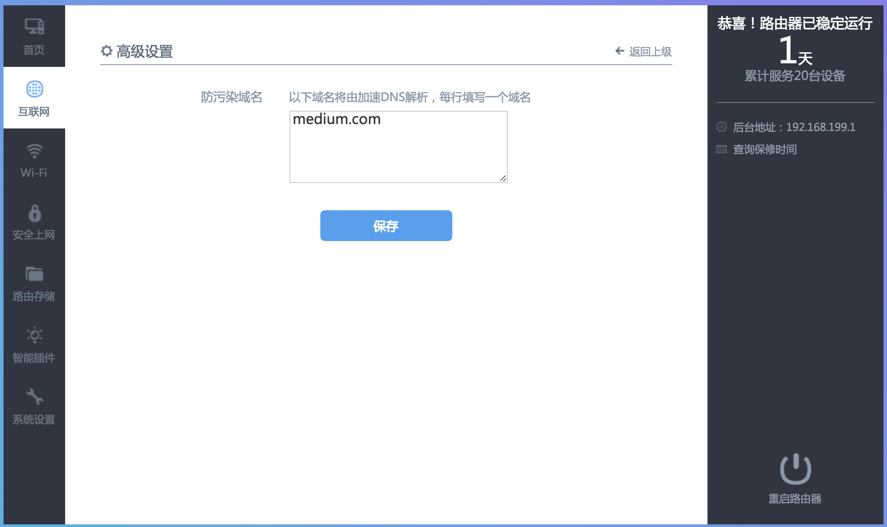

# hiwifi-ss

极路由+ss配置, 适应新版极路由，支持的极路由版本有(__因为没办法测试所有的极路由，所以你能运行的极路由不在这个列表，请给我PR，谢谢！__):

    - HC5761 - 1.0.7.13499s

项目中的gfw规则使用项目 [cokebar/gfwlist2dnsmasq](https://github.com/cokebar/gfwlist2dnsmasq) 生成的规则修改而成，最后更新日期为2016.08.07。

### 安装方法

1. 旧版hiwifi => 请参见博客: [极路由Shadowsocks家庭无痛翻墙实践](https://luolei.org/hiwifi-shadowsocks/)

2. 新版hiwifi => 使用项目根目录下的 `shadow.sh` 脚本进行安装, 建议使用以下一键命令:

```sh
cd /tmp && curl -k -o shadow.sh https://raw.githubusercontent.com/qiwihui/hiwifi-ss/master/shadow.sh && sh shadow.sh && rm shadow.sh
```

### 如何在服务器端启用`chacha20`的支持：

1. 编译并安装libsodium:

```
apt-get update
apt-get install build-essential
wget https://github.com/jedisct1/libsodium/releases/download/1.0.3/libsodium-1.0.3.tar.gz
tar xf libsodium-1.0.3.tar.gz && cd libsodium-1.0.3
./configure && make && make install
```

2. 修复动态链接库:
然后编辑 `/etc/ld.so.conf` 文件， 加入一行 `/usr/local/lib` 并保存。运行命令 `ldconfig`

3. 在ss配置中修改为 `chacha20` 即可

备注： 参考[xqd的小站](https://php-rmcr7.rhcloud.com/chacha20/)整理，Thank you!

### 常见问题

0. 支持哪些加密方法？

理论上 ss-local 2.4.7 能支持的算法都支持。

1. 安装后显示`请求的接口不存在`?

请重启路由器.

2. 适用极路由版本有哪些?

目前应该是只适用于 `1.x` 版本(比如`1.0.7.13499s`), 不适用于 `0.901X` 版本的极路由.

3. 如何卸载脚本?([issue#12](https://github.com/qiwihui/hiwifi-ss/issues/12))

将`/usr/lib/lua/luci/view/admin_web/network/index.htm.ssbak` 重命名为 `/usr/lib/lua/luci/view/admin_web/network/index.htm`, 并移除ss: `opkg remove geewan-ss`

4. 如果出现类似下面的报错，请确保你是登录到极路由后台执行脚本: `ssh root@192.168.199.1 -p 1022`， 不要在自己的电脑上执行 :(

```sh
x etc/: Could not remove symlink etc
x etc/config/: Cannot extract through symlink etc
x etc/firewall.d/: Cannot extract through symlink etc
x etc/gw-redsocks/: Cannot extract through symlink etc
x etc/gw-redsocks.conf: Cannot extract through symlink etc
x etc/gw-shadowsocks/: Cannot extract through symlink etc
x etc/init.d/: Cannot extract through symlink etc
x etc/rc.d/: Cannot extract through symlink etc
x etc/ss/: Cannot extract through symlink etc
......
```

### TODO

 - [x] 适应新版本界面

   - [x] 开关样式
   - [x] 增加"shadowsocks设置"按钮
   - [x] "shadowsocks设置"按钮功能修复
   - [x] 密码显示功能修复
   - [x] 弹出提示框修复
   - [x] 下拉框样式修复
   - [x] "导入配置文件(json格式)"界面修复; 界面修复了，但是底层功能有问题；
   - [x] "高级设置"界面修复

 - [x] release/v1.1.0 => 完成之前所有功能在新版下的界面适配
 - [x] 使用github作为文件存储, 既然能用 `raw.githubusercontent.com` 下脚本，下载 `ss.tar.gz` 应该也不成问题，只是慢些；
 - [x] 底层增加更多的路由规则
 - [ ] 关于底层源码开源的一些问题

### 贡献

1. 如果你在使用中有什么问题或者建议，请不要吝啬，给我提一个issue;
2. 如果你对代码有自己的想法并实现了，请给我一个Pull Request;
3. 不接收邮件了，问题大家都应该看到，这样减少重复回答，请提issue，谢谢～

### 目前状态

1. 新版界面

(1). ss子菜单在网络设置下:


(2). ss账号设置


(3). ss高级设置


