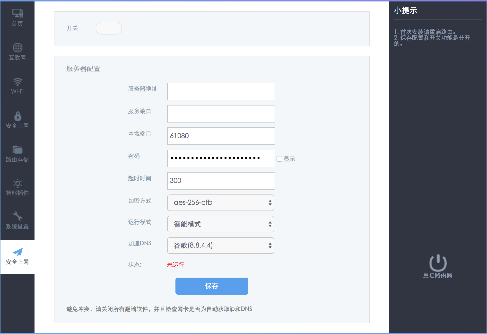

# hiwifi-ss

> We shall fight on the beaches.

极路由+ss配置, 适应新版极路由，支持的极路由版本有(__因为没办法测试所有的极路由，所以你能运行的极路由不在这个列表，请在[issue#38](https://github.com/qiwihui/hiwifi-ss/issues/38)中回复，谢谢！__):

现在项目使用的是大陆白名单模式，关于适用大陆白名单和gfwlsit的处理，见[issue#37](https://github.com/qiwihui/hiwifi-ss/issues/37)。项目中的gfw规则使用项目 [cokebar/gfwlist2dnsmasq](https://github.com/cokebar/gfwlist2dnsmasq) 生成的规则修改而成，最后更新日期为2017.08.08。

### 安装方法

1. 新版hiwifi => 使用项目根目录下的 `shadow.sh` 脚本进行安装, 建议使用以下一键命令:

    ```bash
    cd /tmp && curl -k -o shadow.sh https://raw.githubusercontent.com/qiwihui/hiwifi-ss/master/shadow.sh && sh shadow.sh && rm shadow.sh
    ```

2.  hiwifi 1.2.5.15805s

    ```bash
    cd /tmp && curl -k -o shadow.sh https://raw.githubusercontent.com/qiwihui/hiwifi-ss/master/shadow.sh && sh shadow.sh 12515805s && rm shadow.sh
    ```

### 本地更新dnsmasq.conf

使用项目 [gfwlist2dnsmasq](https://github.com/cokebar/gfwlist2dnsmasq.git) 中的脚本即可

```bash
git clone https://github.com/cokebar/gfwlist2dnsmasq.git
cd gfwlist2dnsmasq
./gfwlist2dnsmasq.sh --port 53535 -o gw-shadowsocks.dnslist

# 复制 gw-shadowsocks.dnslist 到 hiwifi-ss/etc/gw-shadowsocks/gw-shadowsocks.dnslist 打包
# 或者，直接复制到极路由 etc/gw-shadowsocks/gw-shadowsocks.dnslist 上
```

### 本地安装/开发

以 tag `v1.0.5` 为例

```bash
# 本地生成 tar 包
git clone git@github.com:qiwihui/hiwifi-ss.git
cd hiwifi-ss
git checkout v1.0.5
tar -C ./ -czvf hiwifi-ss.tar.gz etc lib usr
scp -P 1022 hiwifi-ss.tar.gz root@192.168.199.1:/tmp

# ssh登录极路由
tar xzvf /tmp/hiwifi-ss.tar.gz -C /
```

### 如何在服务器端启用`chacha20`的支持：

1. 编译并安装libsodium:

   ```
   apt-get update
   apt-get install build-essential
   wget https://github.com/jedisct1/libsodium/releases/download/1.0.3/libsodium-1.0.3.tar.gz
   tar xf libsodium-1.0.3.tar.gz && cd libsodium-1.0.3
   ./configure && make && make install
   ```

2. 修复动态链接库:

编辑 `/etc/ld.so.conf` 文件， 加入一行 `/usr/local/lib` 并保存。运行命令 `ldconfig`

3. 在ss配置中修改为 `chacha20` 即可

备注： 参考[xqd的小站](https://php-rmcr7.rhcloud.com/chacha20/)整理，Thank you!

### 常见问题

0. 支持哪些加密方法？

  理论上 ss-local 2.4.7 能支持的算法都支持。

1. 安装后显示`请求的接口不存在`?

  请重启路由器. [issue#28](https://github.com/qiwihui/hiwifi-ss/issues/28)

2. 适用极路由版本有哪些?

  see [issue#38](https://github.com/qiwihui/hiwifi-ss/issues/38)

3. 如何卸载脚本?([issue#12](https://github.com/qiwihui/hiwifi-ss/issues/12))

  将`/usr/lib/lua/luci/view/admin_web/network/index.htm.ssbak` 重命名为 `/usr/lib/lua/luci/view/admin_web/network/index.htm`, 并移除ss: `opkg remove geewan-ss`

4. 如果出现类似下面的报错，请确保你是登录到极路由后台执行脚本: `ssh root@192.168.199.1 -p 1022`， 不要在自己的电脑上执行 :(

    ```sh
    x etc/: Could not remove symlink etc
    x etc/config/: Cannot extract through symlink etc
    x etc/firewall.d/: Cannot extract through symlink etc
    x etc/gw-redsocks/: Cannot extract through symlink etc
    x etc/gw-redsocks.conf: Cannot extract through symlink etc
    x etc/gw-shadowsocks/: Cannot extract through symlink etc
    x etc/init.d/: Cannot extract through symlink etc
    x etc/rc.d/: Cannot extract through symlink etc
    x etc/ss/: Cannot extract through symlink etc
    ......
    ```

5. 项目如何开机自动运行？

  项目在 `/etc/rc.d/` 下添加了 `S99gw-shadowsocks` 指向 `/etc/init.d/gw-shadowsocks`，所以会开机自动运行的。

### 关于底层源码开源的一些问题

这个项目基于 geewan 的 hiwifi 配置程序，底层只有编译后的 lua 程序，除开用到的 shadowsocks 使用了 GPL 协议, 其他部分不开源也并没有问题。
本着共同进步的原则，作者尝试完成了部分功能的实现并开源，不足之处请多指教。

本项目会不断补充并完善功能，只是作者开发时间不长，进度会比较慢，请勿催~

### TODO

1. 第一阶段

  - [x] 适应新版本界面

    - [x] 开关样式
    - [x] 增加"shadowsocks设置"按钮
    - [x] "shadowsocks设置"按钮功能修复
    - [x] 密码显示功能修复
    - [x] 弹出提示框修复
    - [x] 下拉框样式修复
    - [x] "导入配置文件(json格式)"界面修复; 界面修复了，但是底层功能有问题；
    - [x] "高级设置"界面修复

  - [x] release/v1.1.0 => 完成之前所有功能在新版下的界面适配
  - [x] 使用github作为文件存储, 既然能用 `raw.githubusercontent.com` 下脚本，下载 `ss.tar.gz` 应该也不成问题，只是慢些；
  - [x] 底层增加更多的路由规则
  - [x] 关于底层源码开源的一些问题

2. 下一阶段

  - [x] 升级 ss-libev 版本
  - [ ] 支持 ss-libev 混淆 （simple-obfs）
  - [ ] 支持 SSR

### 贡献

1. 如果你在使用中有什么问题或者建议，请不要吝啬，给我提一个issue;
2. 如果你对代码有自己的想法并实现了，请给我一个Pull Request;
3. 不接收邮件了，问题大家都应该看到，这样减少重复回答，请提issue，谢谢～

### 目前状态

1. 新版界面

(1). ss账号设置

  
