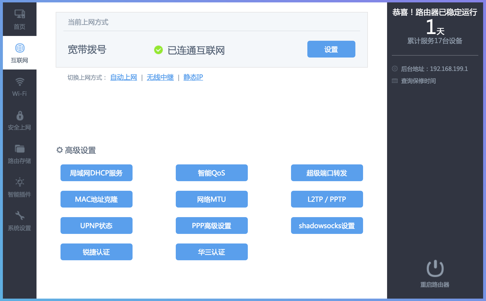

# hiwifi-ss

极路由+ss配置, 适合旧版界面以及新版界面的极路由

### 安装方法(待完善)

1. 旧版hiwifi => 请参见博客: [极路由Shadowsocks家庭无痛翻墙实践](https://luolei.org/hiwifi-shadowsocks/)

2. 新版hiwifi => 使用项目根目录下的 `shadow.sh` 脚本进行安装

一键命令:

```sh
cd /tmp && wget https://raw.githubusercontent.com/qiwihui/hiwifi-ss/master/shadow.sh && sh shadow.sh && rm shadow.sh
```

### TODO 

 - [ ] 适应新版本界面 => 1.0.7.13499s版本

   - [x] 开关样式
   - [x] 增加"shadowsocks设置"按钮
   - [x] "shadowsocks设置"按钮功能修复
   - [ ] 密码显示功能修复
   - [ ] 下拉框样式修复
   - [ ] "导入配置文件(json格式)"界面修复
   - [ ] "高级设置"界面修复
 
 - [ ] release/v1.1.0 => 完成之前所有功能在新版下的界面适配 
 - [ ] 底层增加更多的路由规则
 - [ ] 关于底层源码开源的一些问题

### 目前状态

1. 旧版已支持

2. 新版界面

(1). ss子菜单在网络设置下:



(2). ss账号设置
 

